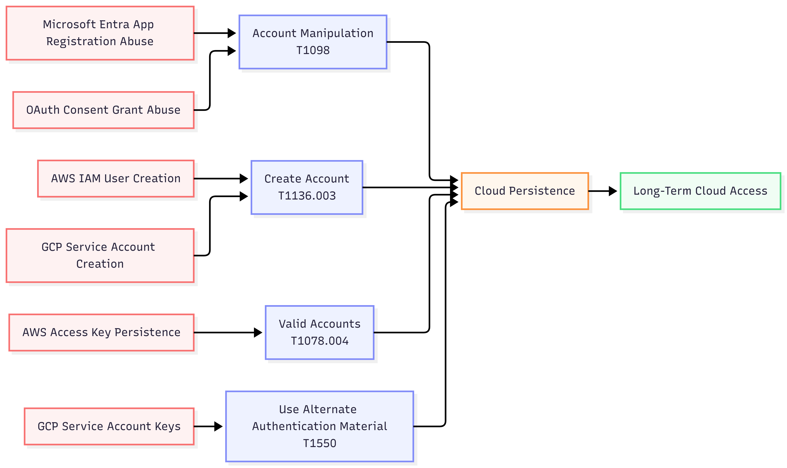
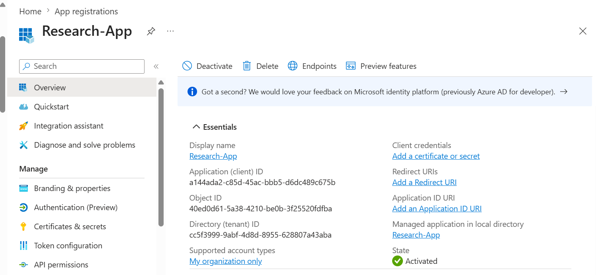
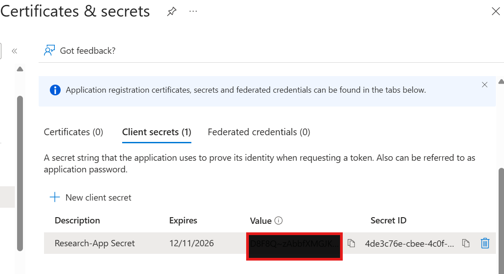
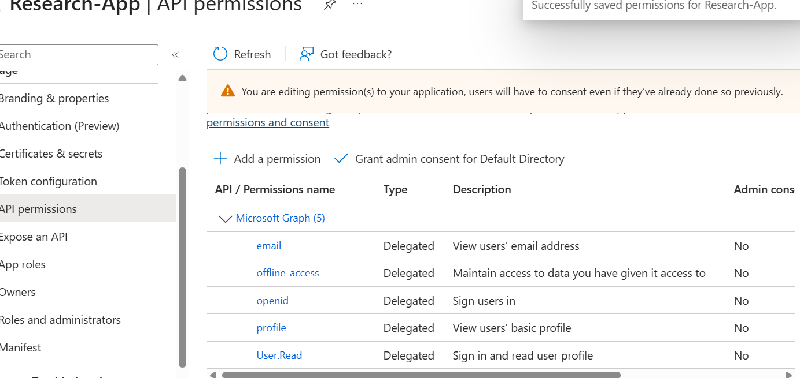
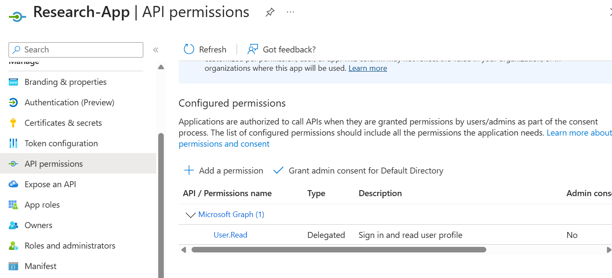
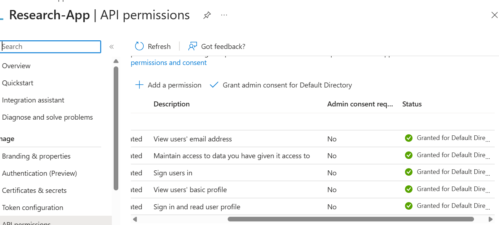
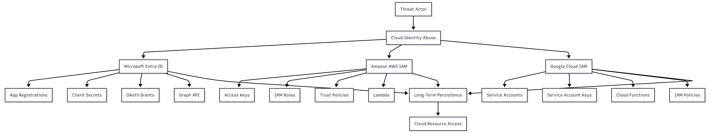

# Cloud Persistence Techniques Research Lab

## Overview

This project explores cloud persistence techniques used by threat actors across Microsoft Entra ID (Azure), Amazon Web Services (AWS), and Google Cloud Platform (GCP).

Unlike traditional persistence mechanisms that rely on malware or endpoint modifications, cloud persistence often leverages legitimate identity and access management (IAM) functionality such as application registrations, service accounts, access keys, trust relationships, and OAuth permissions.

The goal of this project is to understand how attackers establish persistence in cloud environments and how defenders can detect and investigate these activities.

---

## Objectives

* Research cloud identity persistence mechanisms
* Map persistence techniques to MITRE ATT&CK
* Identify detection opportunities
* Document cloud-native attack paths
* Develop cloud threat hunting knowledge
* Understand identity-based persistence across major cloud providers

---

## Cloud Platforms Covered

### Microsoft Entra ID

Topics:

* Application Registrations
* Client Secrets
* OAuth Permissions
* Microsoft Graph Access
* Refresh Token Abuse
* Admin Consent Grants

### Amazon Web Services (AWS)

Topics:

* IAM User Persistence
* Access Key Abuse
* Trust Policy Manipulation
* Lambda Persistence
* Cross-Account Access

### Google Cloud Platform (GCP)

Topics:

* Service Account Abuse
* Service Account Keys
* IAM Role Manipulation
* Cloud Function Persistence
* OAuth Application Abuse

---

## Repository Structure

```text
cloud-persistence-techniques/
├── README.md
├── screenshots/
├── docs/
│   ├── azure-persistence.md
│   ├── aws-persistence.md
│   ├── gcp-persistence.md
│   ├── detection-guide.md
│   └── threat-research-notes.md
└── detections/
```

---

## MITRE ATT&CK Coverage

| Technique                             | ATT&CK ID |
| ------------------------------------- | --------- |
| Account Manipulation                  | T1098     |
| Valid Accounts                        | T1078     |
| Create Cloud Account                  | T1136.003 |
| Cloud Service Discovery               | T1526     |
| Account Discovery                     | T1087     |
| Serverless Execution                  | T1505.003 |
| Steal Application Access Token        | T1528     |
| Use Alternate Authentication Material | T1550     |

---
## MITRE ATT&CK Mapping

This research maps common cloud persistence mechanisms to MITRE ATT&CK techniques frequently observed in cloud and identity-focused intrusions.




## Detection Focus Areas

The project documents detection opportunities for:

* New application registrations
* Client secret creation
* OAuth consent grants
* IAM user creation
* Access key generation
* Trust policy modifications
* Service account creation
* Service account key generation
* Serverless function deployment
* Privileged role assignments

---

## Screenshots

### App Registration Overview



### Client Secret Creation



### Graph Delegated Permissions



### API Permissions



### Admin Consent Granted



---

## Architecture Diagram




## Key Research Findings

Cloud persistence differs from traditional persistence because attackers frequently abuse legitimate identity and access management features rather than deploying malware.

Identity systems have become one of the most important attack surfaces in modern cloud environments. Understanding application registrations, OAuth permissions, service accounts, access keys, and trust relationships is critical for effective threat detection and incident response.

---

## Skills Demonstrated

* Identity and Access Management (IAM)
* OAuth 2.0
* OpenID Connect (OIDC)
* JWT Analysis
* Microsoft Entra ID
* AWS IAM
* GCP IAM
* Cloud Security
* Threat Hunting
* Threat Intelligence
* MITRE ATT&CK Mapping
* Detection Engineering

---

## Author

Brianna Wandt

Cloud Security | Identity Security | Threat Intelligence | Threat Research
