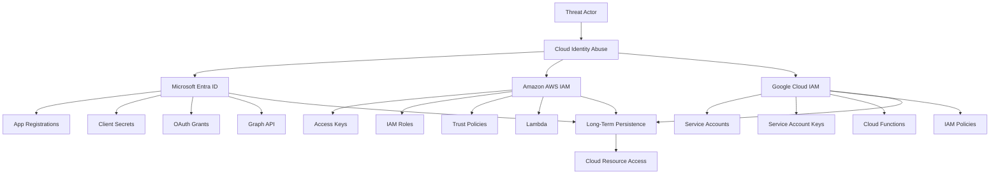

# Cloud Persistence Architecture

```mermaid
flowchart TD
  n0[Threat Actor]
  n1[Cloud Identity Abuse]
  n2[Microsoft Entra ID]
  n3[Amazon AWS IAM]
  n4[Google Cloud IAM]
  n5[App Registrations]
  n6[Client Secrets]
  n7[OAuth Grants]
  n8[Graph API]
  n9[Access Keys]
  n10[IAM Roles]
  n11[Trust Policies]
  n12[Lambda]
  n13[Service Accounts]
  n14[Service Account Keys]
  n15[Cloud Functions]
  n16[IAM Policies]
  n17[Long-Term Persistence]
  n18[Cloud Resource Access]

  n0 --> n1
  n1 --> n2
  n1 --> n3
  n1 --> n4
  n2 --> n5
  n2 --> n6
  n2 --> n7
  n2 --> n8
  n3 --> n9
  n3 --> n10
  n3 --> n11
  n3 --> n12
  n4 --> n13
  n4 --> n14
  n4 --> n15
  n4 --> n16
  n2 --> n17
  n3 --> n17
  n4 --> n17
  n17 --> n18
```